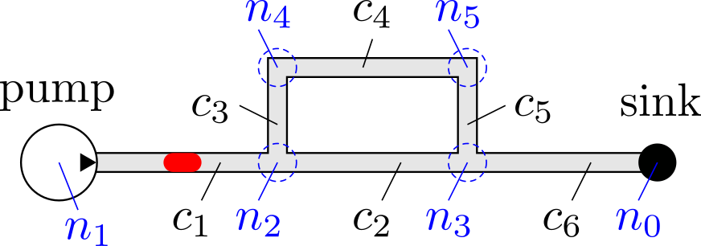

# MMFT Droplet Simulator
A Droplet Simulator for Microfluidic Biochips developed by the [Chair for Design Automation](https://www.cda.cit.tum.de/) at the [Technical University of Munich](https://www.tum.de/) as part of the Munich MicroFluidic Toolkit (MMFT).
This simulator exploits the 1D analysis model, which is especially suited for simulating designs before even the first prototype is fabricated and for design space explorations. Furthermore, it allows to simulate droplets and their respective paths inside a Lab-on-a-Chip (LoC) with closed micro-channels.
More details about the implementation can be found in

[[1]](https://www.cda.cit.tum.de/files/eda/2019_jetc_advanced_simulation_droplet_microfluidics.pdf) A. Grimmer, M. Hamidović, W. Haselmayr, and R. Wille. Advanced Simulation of Droplet Microfluidics. Journal on Emerging Technologies in Computing Systems (JETC), 2019.

A corresponding case study is provided in:

[[2]](https://www.cda.cit.tum.de/files/eda/2018_rscadv_simulation_before_fabrication.pdf) A. Grimmer, X. Chen, M. Hamidovic, W. Haselmayr, C. L. Ren, and R. Wille. Simulation before fabrication: a case study on the utilization of simulators for the design of droplet microfluidic networks. RSC Advances, 8(60):34733–34742, 2018.

For more information about our work on Microfluidics, please visit https://www.cda.cit.tum.de/research/microfluidics/. 

If you have any questions, feel free to contact us via microfluidics.cda@xcit.tum.de or by creating an issue on GitHub. 

## System Requirements
The implementation should be compatible with any current C++ compiler supporting C++17 and a minimum CMake version 3.21. 

If you have doxygen installed, a detailed documentation can be build with the following command inside the build folder of the project: 
```bash 
make dropletDocumentation
```

The documentation will be written to the doc folder within your build folder.

## Usage
To use this library, include the following code in your cmake file: 
```cmake
include(FetchContent)
FetchContent_Declare(
    droplet
    GIT_REPOSITORY https://github.com/cda-tum/mmft-droplet-simulator.git
    GIT_TAG master
)
FetchContent_MakeAvailable(droplet)

target_link_libraries(${TARGET} PRIVATE droplet)
```
and include the library API header in your project file:
```cpp
#include "droplet-simulator/Simulator.h"
```

## Example
This small example shows how to create and simulate the network shown in the following figure, where the channels and nodes are indicated with *c* and *n*, respectively.



In order to simulate the network the following steps have to be conducted:
1. Create the simulator.
2. Add one or more pumps.
3. Add channels with their dimensions (height, width, length) according to how they are connected inside the network.
4. Define nodes as sinks, where droplets get removed from the network.
5. Define a ground node, which acts as a reference node for the pressure value in each node.
6. Add fluids with certain viscosities and densities.
7. Define the fluid which acts as the continuous phase.
8. Add droplets that should be injected into the network. Here the fluid and the volume of the droplet must be specified. Additionally, the time and position (i.e., in which channel at which relative position inside this channel) the droplet should be injected into the network also have to be declared.
9. Optionally check if the chip has a valid structure or if the user build an invalid chip that most likely won't simulate correctly.
10. Run the simulation and print the results.

```cpp
#include <iostream>

#include "droplet-simulator/Results.h"
#include "droplet-simulator/Simulator.h"

int main(int argc, char const* argv[]) {
    // 1. Create the simulator
    std::cout << "--- Main ---" << std::endl;
    droplet::Simulator sim;

    // 2. Add pumps
    std::cout << "--- flowRatePump ---" << std::endl;
    auto flowRate = 3e-11;
    // Create flow-rate pump from node 0 to node 1 with the given flow-rate
    auto pump = sim.addFlowRatePump(0, 1, flowRate);

    // 3. Add channels
    std::cout << "--- channels ---" << std::endl;
    auto cWidth = 100e-6;
    auto cHeight = 30e-6;
    auto cLength = 1000e-6;

    // Create channel from node 1 to node 2 with the given height, width, length
    auto c1 = sim.addChannel(1, 2, cHeight, cWidth, cLength);
    // Create channel from node 2 to node 3 with the given height, width, length
    auto c2 = sim.addChannel(2, 3, cHeight, cWidth, cLength);
    // Create channel from node 2 to node 4 with the given height, width, length
    auto c3 = sim.addChannel(2, 4, cHeight, cWidth, 0.5 * cLength);
    // Create channel from node 4 to node 5 with the given height, width, length
    auto c4 = sim.addChannel(4, 5, cHeight, cWidth, cLength);
    // Create channel from node 5 to node 3 with the given height, width, length
    auto c5 = sim.addChannel(5, 3, cHeight, cWidth, 0.5 * cLength);
    // Create channel from node 3 to node 0 with the given height, width, length
    auto c6 = sim.addChannel(3, 0, cHeight, cWidth, cLength);

    // 4. Define sinks
    std::cout << "--- sink ---" << std::endl;
    // Define that node 0 is a sink
    sim.addSink(0);

    // 5. Define ground node
    std::cout << "--- ground ---" << std::endl;
    // Define that node 0 is the ground node
    sim.addGround(0);

    // 6. Add fluids
    std::cout << "--- fluids ---" << std::endl;
    // Add fluid with 1e-3 viscosity and 1e3 density
    auto fluid0 = sim.addFluid(1e-3, 1e3);
    // Add fluid with 3e-3 viscosity and 1e3 density
    auto fluid1 = sim.addFluid(3e-3, 1e3);

    // 7. Define the continuous phase
    std::cout << "--- continuousPhase ---" << std::endl;
    sim.setContinuousPhase(fluid0);

    // 8. Add droplets
    std::cout << "--- droplet ---" << std::endl;
    auto dropletVolume = 1.5 * cWidth * cWidth * cHeight;
    // Create a droplet of fluid1, with a given droplet volume, injected at injectionTime 0.0
    // in channel with the channelId c1 at relative injection position 0.5
    auto droplet0 = sim.addDroplet(fluid1, dropletVolume, 0.0, c1, 0.5);

    // 9. (Optional) check if chip is valid
    std::cout << "--- validity check chip ---" << std::endl;
    sim.checkChipValidity();

    // 10. Run the simulation
    std::cout << "--- simulate ---" << std::endl;
    auto result = sim.simulate();

    // Print the results
    std::cout << "--- result ---" << std::endl;
    std::cout << result.toJson(4) << std::endl;

    return 0;
}
```

## Reference
If you use our tool for your research, we will be thankful if you refer to it by citing the following publication.

```bibtex
@article{fink2022mmft,
   title={MMFT Droplet Simulator: Efficient Simulation of Droplet-based Microfluidic Devices},
   author={Fink, Gerold and Costamoling, Florina and Wille, Robert},
   journal={Software Impacts},
   doi={10.1016/j.simpa.2022.100440},
   year={2022}
}
```